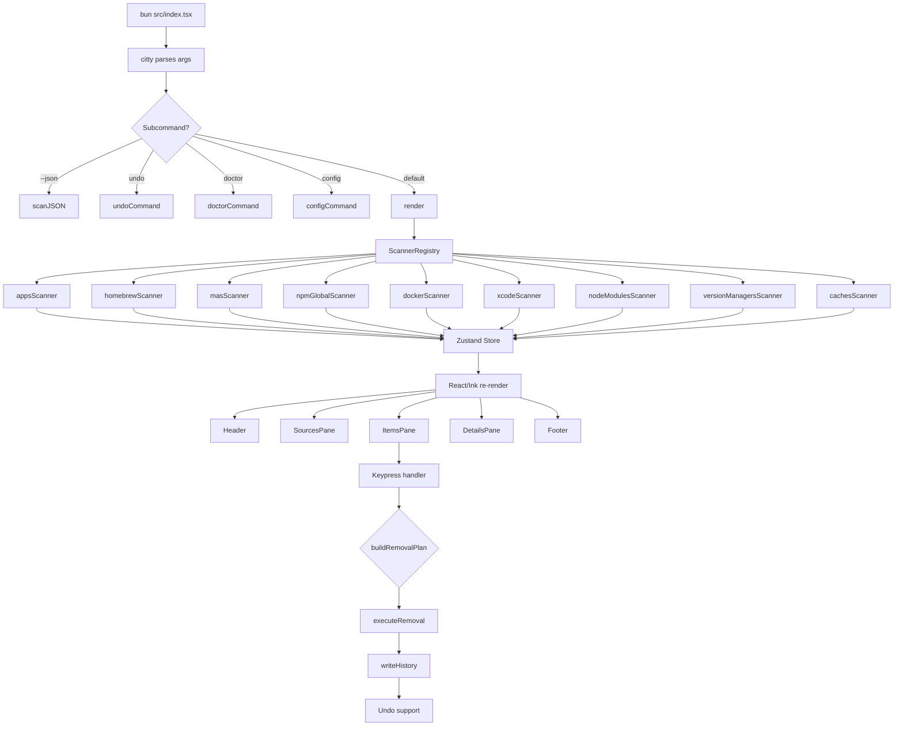

# Architecture

```mermaid
flowchart TD
    A[bun src/index.tsx] --> B[citty parses args]
    B --> C{Subcommand?}
    C -->|--json| D[scanJSON]
    C -->|undo| E[undoCommand]
    C -->|doctor| F[doctorCommand]
    C -->|config| G[configCommand]
    C -->|default| H[render <App/>]

    H --> I[ScannerRegistry]
    I --> J1[appsScanner]
    I --> J2[homebrewScanner]
    I --> J3[masScanner]
    I --> J4[npmGlobalScanner]
    I --> J5[dockerScanner]
    I --> J6[xcodeScanner]
    I --> J7[nodeModulesScanner]
    I --> J8[versionManagersScanner]
    I --> J9[cachesScanner]

    J1 --> K[Zustand Store]
    J2 --> K
    J3 --> K
    J4 --> K
    J5 --> K
    J6 --> K
    J7 --> K
    J8 --> K
    J9 --> K

    K --> L[React/Ink re-render]
    L --> M1[Header]
    L --> M2[SourcesPane]
    L --> M3[ItemsPane]
    L --> M4[DetailsPane]
    L --> M5[Footer]

    M3 --> N[Keypress handler]
    N --> O{buildRemovalPlan}
    O --> P[executeRemoval]
    P --> Q[writeHistory]
    Q --> R[Undo support]
```

See [SPEC.md](../SPEC.md) for full details.
